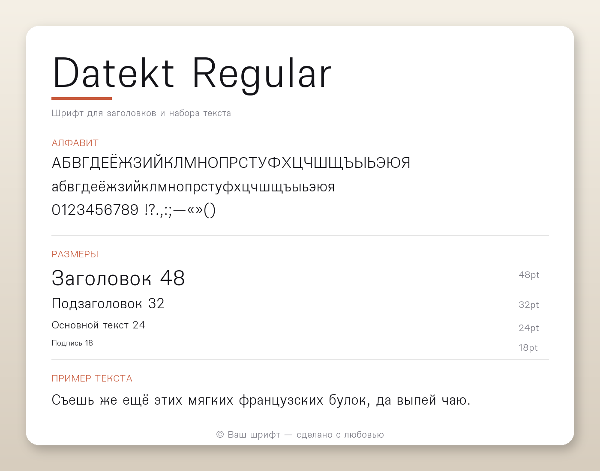

# Datekt Font

An open-source typeface developed under the **Datekt Consortium**. Designed perfectly for both headlines and body text.

## Previews

### Regular / Bold Style

| Latin Alphabet | Cyrillic Alphabet |
| :---: | :---: |
|  |  |

### Thin / Light Style

| Latin Alphabet | Cyrillic Alphabet |
| :---: | :---: |
|  |  |

## Layouts & Styles
The font includes two fully compiled TrueType styles:
* `Datekt-Regular.ttf`
* `Datekt-Black.ttf`

Features full **Cyrillic** (including Bulgarian and Serbian localized forms) and extended Latin character sets, as well as OpenType features (Oldstyle figures, fractions, and indices).

## Installation
1. Download the `.ttf` files from this repository.
2. Open the files and click **Install** on your operating system (Windows/macOS/Linux).

## License
This Font Software is licensed under the **SIL Open Font License, Version 1.1**. 
For full details, please refer to the `OFL.txt` file in this repository.

---
© 2026 The Datekt Consortium